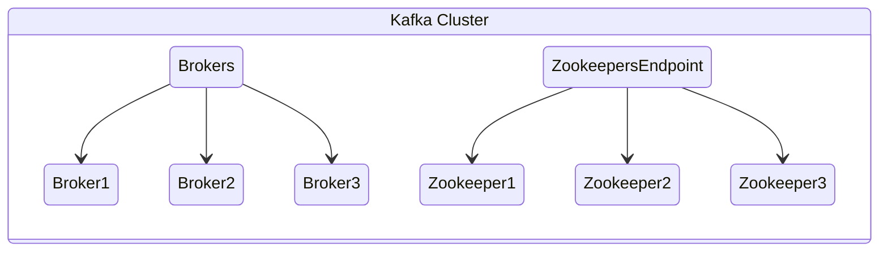

# Concepts of Kafka and Strimzi

The goal of this documentation is to accelerate the ownership of a Kafka service in Kubernetes. We do this with the Strimzi operator, but this specific document is here to accelerate understanding of core Kafka concepts. This lays a foundational lens to see how cloud native thinking can be used to make owning every layer more effective.

First, lets imagine a small production ready cluster. We'll go through the parts and what they're for in a moment, for now, just see how they are laid out, without any Kubernetes or other orchestration mechanisms. Just pure Kafka concepts.

## Service vs Instance, and The Importance of Names

TO BE CONTINUED!!!
