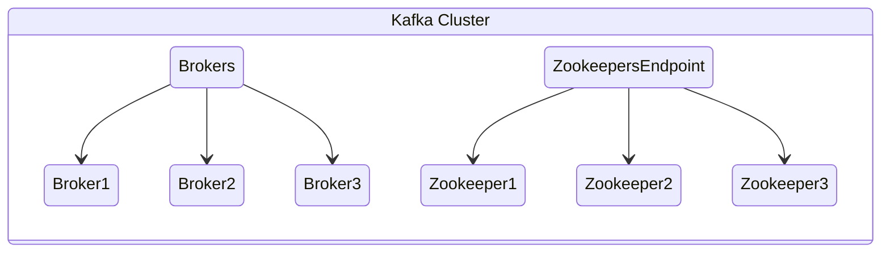

# Concepts of Kafka and Strimzi

The goal of this documentation is to accelerate the ownership of a Kafka service in Kubernetes. We do this with the Strimzi operator, but this specific document is here to accelerate understanding of core Kafka concepts. This lays a foundational lens to see how cloud native thinking can be used to make owning every layer more effective.

First, lets imagine a small production ready cluster. We'll go through the parts and what they're for in a moment, for now, just see how they are laid out, without any Kubernetes or other orchestration mechanisms. Just pure Kafka concepts.

## Service vs Instance, and The Importance of Names

Kafka is not particularly cloud native, and nothing makes this more important than each broker being named as the [pet](http://cloudscaling.com/blog/cloud-computing/the-history-of-pets-vs-cattle/) that they are. Adding or removing brokers from the cluster is an operation that requires coordinating across cluster and clients.

Keeping this lightweight for clients reduces the amount of configuration required to be had by clients. In earlier kafka, we had a setting that was simply a list of "bootstrap" servers. These were just the brokers to initially talk to which would then give us, the client, all the cluster members and their roles. We would keep several in the bootstrap servers so if one failed, we could still connect to the cluster by choosing a different one. Redundancy is always good for reliability.

This poses a simple problem for Kafka in Kubernetes. The name that each broker knows themselves and each other as is important, and if the external name for those brokers is different, there's an identity mismatch. For example, if internally I am broker-3.my-kafka-cluster.kafka.svc and you connect to me internally via that name, we will be fine and I can likely tell you about all my broker friends by the name I know them as. If you are connecting externally and I'm resolved by broker-3.kafka-cluster-1.internal-domain.xyz, I'm going to respond that you have the wrong cluster.

This coupling has been managed by the Strimzi Operator by adding listeners that are an extra port with a set of override options for names and addresses. The details are not important yet, the concept of _why_ this set of overrides is because it exposes how Kafka works internal and the tradeoff made. When we run connection problems, this is very good to know what is happening under the hood.

Thus, the instance of a broker is a specific long-lived member of the cluster. The service provided by the broker is a separate component to troubleshoot, and the service provided by all brokers is another layer of this to keep in mind as we deploy and operate Kafka.

## Topics, Partitions, and Replicas

Kafka clusters are made up of brokers, and coordinated databases held by Zookeeper. Typically clients don't talk much to Zookeeper directly, but the state of the cluster including clients is very much kept there.

Once the cluster is setup, it still needs to do something useful. Everything we want Kafka to do for us is done in Topics. This is where a lot of newcomers to Kafka stop thinking and let the abstraction become a magic box. We must resist this urge or we will have sadness when the abstraction leaks.

Topics are just named sets of Partitions. Partitions are where data is actually stored. Replicas are just redundant storage of that data. This is important, because once laid out, none of these change where they exist without intervention. We'll discuss that in a troubleshooting exercise.

For now, the real work is in Partitions. A Partition is just an append-only log of messages. Messages can be any size, but they're bytestream data shoved into a file. A broker is elected as a Partition Leader and they will accept all the inputs for a specific partition before replicating to other brokers. Simply put, that broker is the ingest point for that partition if they are the leader. All sorts of scenarios can cause the leader to change, of course, but it will be among those that are caught up on a Replica of that Partition, called an In Sync Replica or more commonly just ISR.

When a Producer sends stuff to Kafka, it will send to a partition leader, and then wait for the `min.insync.replicas` number of ISRs to acknowledge that they, too, have the message before it's considered "sent" and the producer moves to the next batch of messages.

This is also important to notice that not all partitions are advancing at the same rate, and producers talk to Partition Leaders for each partition, not to Topic related controls. Partitions are the real core work point. Topics and Replicas are organizational and operational knobs to configure Partitions by.

Keep this in mind as we own a Kafka deployment or work with it as a Producer or Consumer.

## Authentication and Authorization

Given that Topics are just configuration around a set of Partitions, controls for permissions are configuration we apply at a Topic level. So we control what clients can do through Authorization on Topics. This of course means we need to Authenticate who is who so we can apply those controls to specific clients.

The easiest methods for Auth are mutual TLS or SASL. Oauth exists but there is a heavy investment into using that if we are not already using Oauth for authenticating services to each other. Note that this means if we are using Oauth for authenticating users, this is still heavy investment especially in adjusting our thinking, because services and users are very different.

When doing Authentication and Authorization, we absolutely want tooling in place to manage changes and configuration correctness. In this documentation we're assuming we're letting Strimzi's tooling do that for us and a gitops flow makes this easy. We can extend or even eschew Strimzi's mechanisms, but that's an exercise in pain we won't cover in this doc. We will do mutual TLS with Strimzi generated certificates.

## Data Validation, Schema Registry

Kafka does allow some validation of message format, which is important for some use cases. These require some understanding of caveats, or expectations will lead to problems.

For starters, the Schema Registry is only for Avro schemas, JSON Schema schemas, and Protobuf schemas. If our messages do not conform to one of these, the Schema Registry will not help us at all. This also doesn't prevent us from making breaking compatibility changes in schemas, it just keeps track of versions. So we do not save schema management work from the human processes we all work with.

Kafka also doesn't do any validation of messages against schemas. We can have clients do this, but no guarantees can be provided on the Kafka Cluster side of things to make sure messages are conformant. We can require that messages reference a valid schema version, and that is the extent of the checks Kafka can make. This makes a lot of sense give that Kafka is for high throughput data movement, and checking every message puts a computational burden as well as an action burden on Kafka that will greatly diminish that throughput.

This also means that both Producers and Consumers will need to handle these kinds of validation items, and that is not going to be handled by this document as it is situational. No tooling is going to be able to get rid of the requirement to plan for what the use case needs in terms of strength of validation and handling of errors.

## Concluding Thoughts to Concepts

There are many details to dive into on the journey to Kafka ownership. It's important that we learn by doing, and as such the tutorial section of this documentation will guide us through some exercises in scenarios that will expose us to some application of these concepts as well as some specific related details.

Always remember that the goal is not to know how Kafka works in every respect. The goal is always to understand enough of Kafka to be able to dive into problems and explore them when they arise.

If you want to read more explanatory documentation, some good next articles:

* [Capacity Planning](capacity.md)
* [Data Loss and Availability](data-loss.md)
* [Security](security.md)
