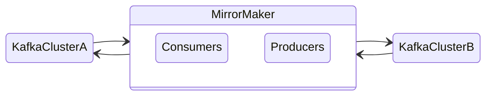

# Multi-Cluster Kafka

A lot of users wish to have region-redundant data in Kafka. We should note here that most users don't need this, it just sounds like a good idea. Most teams will have much more important problems should an entire cloud region go down. Be very careful if choosing Kafka for a use case where multiple regions is a very real requirement, for backups or otherwise.

Here we will discuss the extra trade-offs that come with moving into multiple Kafka clusters coordinating.

## There is no Multi-Cluster

It's important to understand that all multiple cluster kafka deployments are in a very real way simply single clusters glued together in a way that they are unaware of each other.

[Mirror Maker](https://strimzi.io/docs/operators/0.24.0/full/using.html#assembly-deployment-configuration-kafka-mirror-maker-str) and [Mirror Maker 2](https://strimzi.io/blog/2020/03/30/introducing-mirrormaker2/) can both make data redundant on multiple clusters. It does this, in all cases, by having a normal Consumer client read from TopicA in ClusterA, and Produce to TopicA in ClusterB. Just because they are both named TopicA does not mean they are the same topic. There's no guarantees about ordering data (you can arrange it so that this is largely preserved, but this is precarious).

It is much easier to make consumers that process messages in idempotent ways rather than trying to enforce ordering. This is true before we add a second Kafka cluster. If we don't enforce ordering, multiple clusters is much more approachable. Just remember this disconnect where it's really just multiple single clusters with little help from tools.

## Configuration Importance

In a single cluster environment, if we have different configurations on each topic, the blast radius of the risk of misconfiguration is a topic, maybe affecting how brokers are balanced in load.

In a multiple cluster environment, each topic configuration now has to be coordinated with the topic configuration on another cluster, while also maintaining some changes like any ACLs need to now include the Mirror Maker users. Having another set of changes to manage and a set of constraints is more difficult and not commonly made easier by tooling.

A misconfiguration gets even worse in that a misconfiguration can be made that only affects one cluster, or that can cause cascading problems. For instance, if we were to configure Mirror Maker to reproduce bi-directionally, now we have to make sure we don't create an eternal loop, otherwise all traffic will be devoted to producing the same messages back and forth until space or bandwidth runs out.

Such runaway scenarios are not uncommon with careless Mirror Maker usage. We must keep in mind configuration at each layer, and how to manage changes in a coordinated fashion. Having a loop for 5 minutes while changes propagate to each cluster is still a potential reliability problem.

## Lifecycle Changes

Speaking of change propagation, when applying changes to a Kafka cluster, the application of those changes requires a number of considerations. For instance, does the cluster require brokers or zookeeper nodes to be restarted before changes apply? It depends on the change, and what applies changes between versions. Always check the release notes and the documentation before version or configuration changes.

Luckily, the Strimzi Operator will handle a lot of those changes for us really quickly, and for the most part without us having to roll updates or bounce nodes. In a multi-cluster scenario, this changes because now we have to coordinate, and possibly to more than one Operator installation. Does order of updates matter? Do we need to break up an update to more than one change so they can happen in the right time frame. This is like any other highly state-oriented change management, like a database or SAN firmware update.

Keep in mind exactly what is being changed, and organize the automated deployment of changes such that they will be managed in the right timeline. There may be one-off workarounds you have to make up for, such as during a major version update you'll likely want to do more upgrade testing than simply trusting the CI/CD pipeline to figure it all out.
